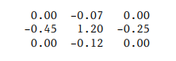
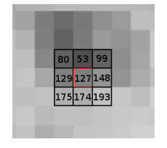
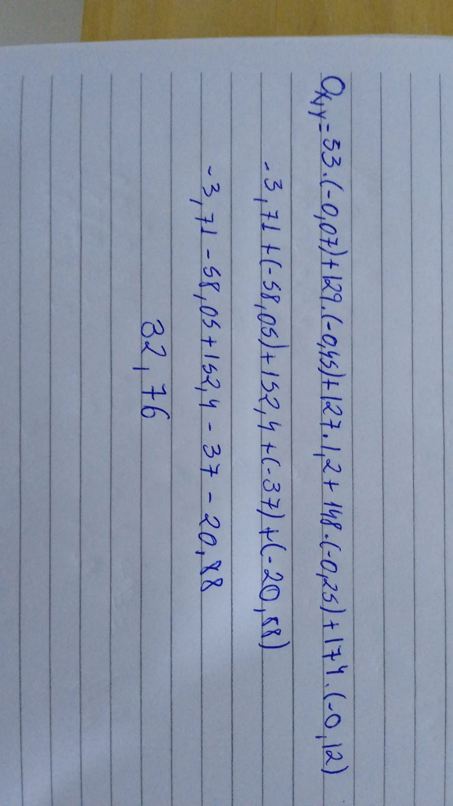

**Questão 1 ->** Uma imagem com 4 px de largura e 1 px de altura com cores [226, 166, 119, 55]. 
Esse teste faz as cores serem invertidas usando a seguinte expressão: 255 - c, onde c é a cor original do pixel
e depois de passar por essa função, ele estará completamente invertido.
Usando o output esperado como exemplo, as cores originais desses pixels seriam [29, 89, 136, 200].
Uma conta de exemplo seria: 255 - 29, que daria 226. E esse é o novo valor do pixel depois de invertido.

##

**Questão 2**   

##

**Questão 3**   
  

Basta multiplicar os valores do kernel de acordo com as posições dos pixels da imagem
(Por questão de praticidade eu não inclui na conta os pixels multiplicados por 0.00)

##

**Questão 4**   

## 

**Questão 5** 

## 

**Questão 6** 
  Kernel Ox / Kernel Oy
   

O kernel Ox dá um destaque maior para as bordas na vertical, já o kernel Oy dá um destaque para as bordas horizontais

